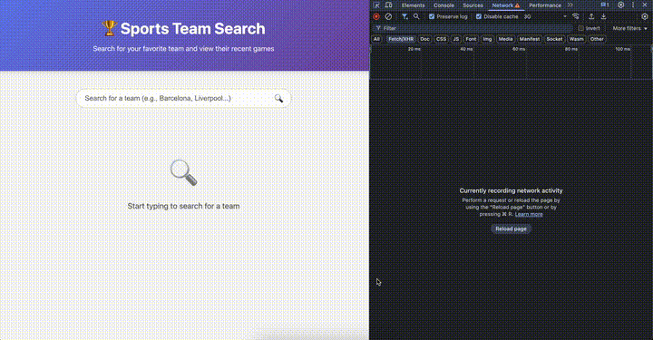

# 🏆 Sports Team Search - Frontend Challenge

## Objective

Build a React application that allows you to search for sports teams and view their recent games in an interactive
scoreboard.

## What You'll Build

Here's what the final application should look like:



### 1. Empty State - Start Searching


*When the user first opens the app, they see a search input*

### 2. Loading State - Searching for Teams


*While searching, a loading spinner appears*

### 3. Team Found - Displaying Team Card


*The first matching team is automatically displayed with stadium, league, and founding year*

### 4. Loading Recent Games


*After fetching a team, the app loads their recent matches*

### 5. Final Result - Scoreboard with Games


*Recent games are displayed showing scores, results (win/loss), and dates*

### 6. Error Handling


*If no teams are found, a clear error message is shown*

## Description

You will implement the **logic** of a sports team search application that consumes the public
API [TheSportsDB](https://www.thesportsdb.com/).

**What's already done:**

- ✅ **All CSS** - No need to write styles
- ✅ **TypeScript Types** - API interfaces already defined
- ✅ **Helper components** - LoadingSpinner, ErrorMessage already implemented
- ✅ **HTML structure in comments** - To guide your implementation

**What you need to implement:**

- 🎯 All the **React logic** (state, effects, handlers)
- 🎯 **Fetch requests** to the APIs
- 🎯 **Rendering logic** of components

The application should:

1. **Search for a team** by name (with automatic debounce)
2. **Display the last games** of that team in a scoreboard format

## Available APIs

### 1. Search Team

```
GET https://www.thesportsdb.com/api/v1/json/3/searchteams.php?t={team_name}
```

**Example:** `https://www.thesportsdb.com/api/v1/json/3/searchteams.php?t=Barcelona`

**Response:**

```json
{
  "teams": [
    {
      "idTeam": "133739",
      "strTeam": "Barcelona",
      "strTeamBadge": "https://...",
      "strStadium": "Camp Nou",
      ...
    }
  ]
}
```

### 2. Get Team's Last Games

```
GET https://www.thesportsdb.com/api/v1/json/3/eventslast.php?id={team_id}
```

**Example:** `https://www.thesportsdb.com/api/v1/json/3/eventslast.php?id=133739`

**Response:**

```json
{
  "results": [
    {
      "idEvent": "...",
      "strEvent": "Barcelona vs Real Madrid",
      "strHomeTeam": "Barcelona",
      "strAwayTeam": "Real Madrid",
      "intHomeScore": "3",
      "intAwayScore": "1",
      "dateEvent": "2024-10-26",
      ...
    }
  ]
}
```

## Technical Constraints

⚠️ **IMPORTANT:**

- **DO NOT** install external libraries
- Use only native browser `fetch`
- Pure CSS only (already done)

## Project Structure

```
src/
├── components/
│   ├── SearchInput.tsx       ⚠️ TODO: Implement
│   ├── TeamCard.tsx          ✅ Done (use this component)
│   ├── Scoreboard.tsx        ⚠️ TODO: Implement
│   ├── LoadingSpinner.tsx    ✅ Done
│   └── ErrorMessage.tsx      ✅ Done
├── types.ts                  ✅ Done
├── App.tsx                   ⚠️ TODO: Implement (main file)
└── *.css                     ✅ All done
```

**Good luck! 🍀**

Remember: CSS is done, types are done, and you have HTML structure in comments. **Focus 100% on the logic!**

If you have questions, ask the interviewer.
